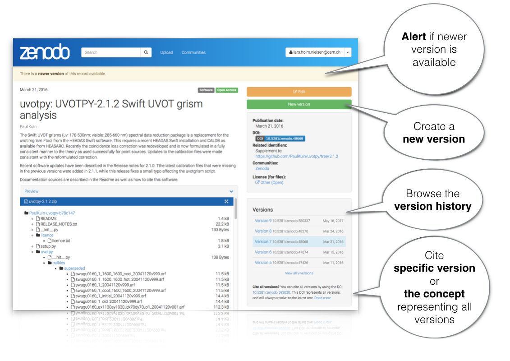
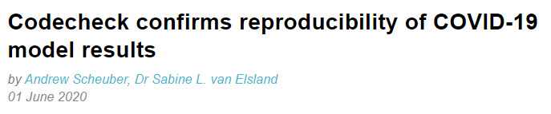
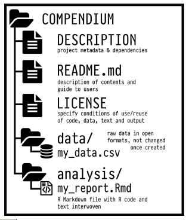
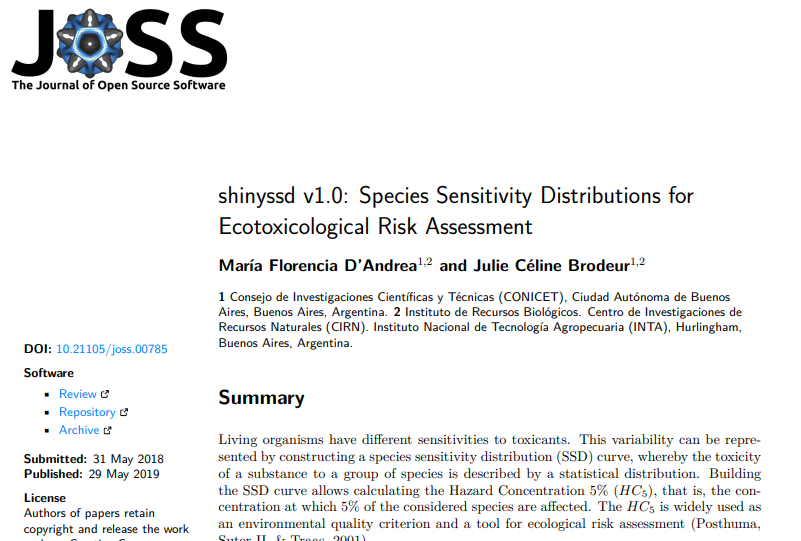
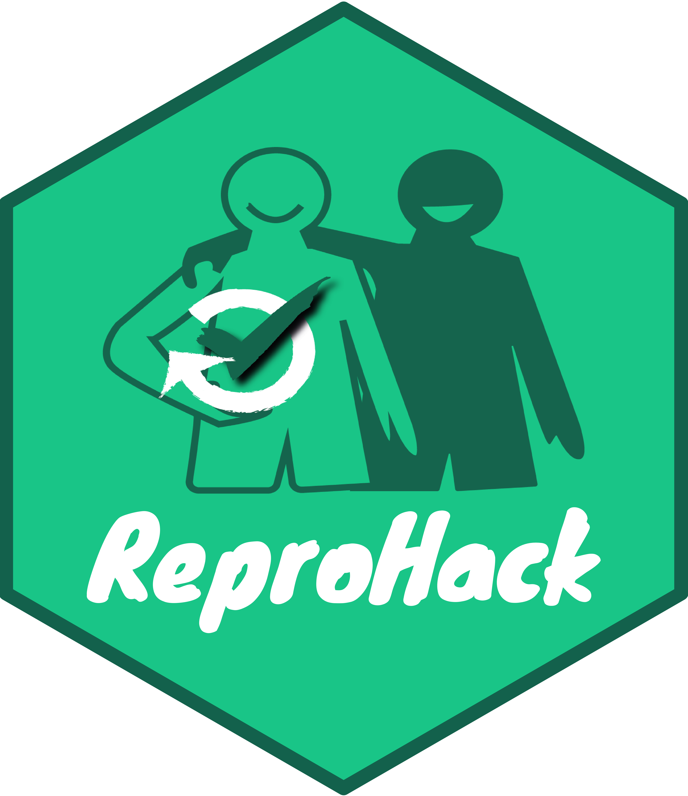

```{r setup, include=FALSE}
options(htmltools.dir.version = FALSE)
```

```{r xaringan-themer, include=FALSE, warning=FALSE}
library(xaringanthemer)
library(xaringanExtra)
library(tidyverse)
library(knitr)
library(icon)
library(nomnoml)
library(countdown)
xaringanExtra::use_logo(
  image_url = "https://raw.githubusercontent.com/rstudio/hex-stickers/master/PNG/xaringan.png"
)
xaringanExtra::use_panelset()
xaringanExtra::use_broadcast()
xaringanExtra::use_share_again()
xaringanExtra::style_share_again(share_buttons = c("twitter", "linkedin"))
xaringanExtra::use_tachyons()
xaringanExtra::use_fit_screen()
xaringanExtra::use_tile_view() # O
style_mono_accent(
  base_color = "#0dc96f",
  background_color = "#ffffff",
  inverse_background_color = "#562457",
  header_color = "#562457",
  inverse_header_color = "#ffffff", 
  inverse_text_color = "#ffffff",
  code_inline_color = "#179c55",
  link_color= "#A406B2",
  text_font_size = "25px",
  header_font_google = google_font("Poppins", "Regular", "400"),
  text_font_google   = google_font("Darker Grotesque", "500"),
  code_font_google   = google_font("Fira Mono"),
  )

```

```{r metathis, echo=FALSE}
library(metathis)
meta() %>%
  meta_name("github-repo" = "flor14/rladies-jujuy") %>% 
  meta_social(
    title = "Meetup R-Ladies Jujuy",
    description = paste(
      "Mi próximo artículo científico con R:", 
      "Compendios de Investigación, Reproducibilidad e",
      "Interactividad en las publicaciones académicas"
    ),
    url = "https://flor14.github.io/rladies-jujuy/presentacion.html?panelset=licencia#1",
    image = "https://res.cloudinary.com/flor/image/upload/v1608248822/jujuy-colores_frmvax.jpg",
    image_alt = paste(
      "Charla para el capítulo de R-Ladies de Jujuy, Argentina.",
      "Diciembre de 2020"
      ),
    og_type = "website",
    og_author = "Florencia D'Andrea",
    twitter_card_type = "summary_large_image",
    twitter_creator = "@cantoflor_87",
    twitter_site = "@cantoflor_87"
  )
```

class: inverse, middle, center

`r countdown(minutes = 5)`

### Empezamos en 5 minutos
Tenes tiempo para irte a buscar el ☕ o preparar el agua para el 🧉

---

class: inverse, center, middle

### ¡Hola R-Ladies Jujuy!


Felicitaciones por el primer meetup


---

background-image: url(imagenes/jujuy-colores.jpg)
background-size: cover
class: bottom

.bg-washed-green.b--dark-green.ba.bw2.br3.shadow-5.ph4.mt5[
### Mi próximo artículo científico en R
### **Compendios de Investigación, Reproducibilidad e Interactividad en las publicaciones académicas**

 .large[####Florencia D'Andrea | R-Ladies Jujuy | 21 de Diciembre de 2020 
]]

---

class: center, middle

### Licencia

<a rel="license" href="http://creativecommons.org/licenses/by/4.0/"></a><br />Este obra está bajo una <a rel="license" href="http://creativecommons.org/licenses/by/4.0/">licencia de Creative Commons Reconocimiento 4.0 Internacional</a>

---

```{r researchc, echo = FALSE, out.width=700, fig.align='center'}
knitr::include_graphics("imagenes/ResearchCycle.jpg")
```

.footnote[[Imagen: The Turing Way Community, & Scriberia (2020). ](http://doi.org/10.5281/zenodo.3695300)]
---

## Desafío
#### Código y datos disponibles

.bg-washed-green.b--dark-green.ba.bw2.br3.shadow-5.ph4.mt5[
#### **Ciencia abierta** práctica de dejar "los resultados primarios de investigaciones financiados con fondos públicos, los artículos y los datos sean accesibles al público en formato digital sin restricciones o con una restricción mínima".]


.footnote[[The Turing Way Community (2019)](https://the-turing-way.netlify.app/reproducible-research/open/open-resources.html) / 
[OECD (2015)](https://www.fct.pt/dsi/docs/Making_Open_Science_a_Reality.pdf)]

---

## Principios FAIR
#### Buenas prácticas para la gestión y administración de datos científicos

.pull-left[

```{r research, echo = FALSE, out.width=700, fig.align='center'}
knitr::include_graphics("imagenes/FAIRPrinciples.jpg")
```
]
.pull-rigth[


**"Acceso tan abierto como sea posible, tan cerrado como sea necesario" (abierto por defecto)**

Se requiere claridad y transparencia en torno a las condiciones que rigen el acceso y la reutilización.

]

#### **F**indable | **A**ccesible | **I**nteroperable | **R**eusable

.footnote[
[Mons *et al.* (2017)](https://content.iospress.com/articles/information-services-and-use/isu824) / [Imagen: The Turing Way Community, & Scriberia. (2020). ](http://doi.org/10.5281/zenodo.3695300)
]

---

```{r journey, echo = FALSE, out.width=700, fig.align='center'}
knitr::include_graphics("imagenes/ReproducibleJourney.jpg")
```


.footnote[[Imagen: The Turing Way Community, & Scriberia (2020)]( http://doi.org/10.5281/zenodo.3695300)]

---

## Datos
 Son hechos u observaciones que proporcionan **evidencia**. 
 
--

## Software 
Es el resultado de un proceso creativo que **proporciona una herramienta** para hacer algo, por ejemplo, con datos.

> El software es ejecutable.

> El software a menudo se desarrolla usando otro software.

--

.footnote[[Lamprecht *et al.* (2020)](https://content.iospress.com/articles/data-science/ds190026)]

---

# **{**Definición**}**
### Software para investigación

.bg-washed-green.b--dark-green.ba.bw2.br3.shadow-5.ph4.mt5[
#### Es que se utiliza para generar, procesar o analizar los resultados para una **publicación** (ya sea en una revista, resumen para congreso, monografía, libro o tesis)
#### Puede comprender desde unas **pocas líneas de código** (...), hasta un paquete de software desarrollado profesionalmente.]

.footnote[[Hettrick *et al.* (2014)](https://doi.org/10.5281/zenodo.608046)]

---

### Diez argumentos en contra de la **ciencia abierta...**

--

####1. ... `no` es siempre abierta.

####2. ...`históricamente ha carecido de diversidad` y exhibido una cultura no inclusiva.

####3. ...se basa en el `pensamiento occidental`.

--

####4. La política de `mi instituto` nunca me permitiría compartir mi trabajo abiertamente.

####5. Mi trabajo no es lo `suficientemente` bueno para compartir.

.footnote[[Ten arguments against Open Science that you can win - Malvika Sharan](https://www.software.ac.uk/blog/2020-12-17-ten-arguments-against-open-science-you-can-win)]

---

### Diez argumentos en contra de la **ciencia abierta...**

--

####6. Le doy ventaja a mis `competidores`.

####7. Escribí este código `solo para mis datos`.

--

####8. `No puedo mantenerlo`, ¿por qué molestarme en compartirlo?

####9. ¿Qué pasa si la gente `juzga` mi código (...)?

####10. Mi trabajo `no será reconocido` y eso no va a ayudar a mi carrera.

--

###**... que puedes ganar:** 

[**Ten arguments against Open Science that you can win** - Malvika Sharan](https://www.software.ac.uk/blog/2020-12-17-ten-arguments-against-open-science-you-can-win)

---

```{r openr, echo = FALSE, out.width=700, fig.align='center'}
knitr::include_graphics("imagenes/openresearch.jpg")
```

.footnote[[Imagen: The Turing Way Community, & Scriberia (2020)]( https://zenodo.org/record/4323154)]


---
## Los datos y el software se citan

**¿Sos autor/a de un artículo?**

* Incluí citas a datos y software en el manuscrito

* Publica tu propios datos y software y citalos también

```{r data2, echo = FALSE, fiout.width=800, fig.align='center'}


```
.footnote[Más formas de citar datos en [The Turing Way Community (2019) - Credit for reproducible research](https://the-turing-way.netlify.app/reproducible-research/credit.html?highlight=cite%20data)]

---

class: middle, center

<blockquote class="twitter-tweet" data-lang="es"><p lang="es" dir="ltr">"When authors say they will "make data available upon request"

'#OpenScienceGif </p>&mdash; Heidi Seibold (@HeidiBaya) <a href="https://twitter.com/HeidiBaya/status/1335897311931740163?s=20">7 December 2020</a></blockquote>


---

## Los datos y el software se citan

**¿Generas datos y software?**

* Depositalo/s en un repositorio "estable" (ej. Zenodo, Figshare, etc)

* Obtené una URLs permanente al repositorio como un `Digital Object Identifier (DOI)`

* Incluí un ejemplo de cómo citarlo en el README o documentación

```{r data, echo = FALSE, out.width=300, fig.align='center'}


```

.footnote[[The Turing Way Community (2019)](https://the-turing-way.netlify.app/reproducible-research/credit.html?highlight=cite%20data) / [Zenodo - DOI versioning](https://help.zenodo.org/#versioning)]

---

```{r doiimage, echo = FALSE, out.width=800, fig.align='center'}

knitr::include_graphics("imagenes/DOI.jpg")
```

.footnote[[Imagen: The Turing Way Community, & Scriberia (2020)]( http://doi.org/10.5281/zenodo.3695300)]
---

```{r doiversion, echo = FALSE, out.width=900, fig.align='center'}


```
.footnote[[Zenodo Blog - Zenodo now supports DOI versioning!](https://blog.zenodo.org/2017/05/30/doi-versioning-launched/)]

---
class: inverse, middle, center

### Demo 1 
### Zenodo
#### [link](https://zenodo.org/deposit/new)

---

class: middle, inverse

### 👉 **Reproducibilidad** 

### Compendio de investigación

### Interactividad


---
class: center, middle


```{nomnoml echo=FALSE, svg= TRUE, fig.width = 10, fig.align = "center"}
# direction: down | center 
#.resaltado: fill=#8f8 title=bold

[Reproducibilidad] -> [Empírica]
[Reproducibilidad] -> [<resaltado> Computacional]
[Reproducibilidad] -> [Estadística]

```

.footnote[[Stodden (2014)](https://www.edge.org/response-detail/25340)]

---

class: center, middle, inverse

### En mi computadora pude reproducir mis resultados ...
### ¿puedo considerar que mi trabajo es reproducible? 

---

## ¿Qué pasa de acá a 10 años?

```{r nt, echo=FALSE, out.width=500, fig.align='center'}
knitr::include_graphics("imagenes/nature1.png")
```

.footnote[[Artículo de Nature](https://www.nature.com/articles/d41586-020-02462-7)]

---

class: center, middle, inverse

## ¿Es suficiente compartir el código y los datos para que otros puedan reproducir mis análisis?

---

class: center, middle

<blockquote class="twitter-tweet" data-lang="es"><p lang="es" dir="ltr">Te pasan un código, preparate para gastar de 3 a 4 horas resolviendo todos los bugs para que funcione. 😒 </p>&mdash; Roxana Villafañe (@data_datum) <a href="https://twitter.com/data_datum/status/1338926940443521031?s=19">15 de Diciembre 2020</a></blockquote>


---
## Ejemplo


[`tidyr v1.0.0`](https://github.com/tidyverse/tidyr/releases) breaking changes 

* Aparecen las funciones `pivot_*()` que reemplazan a `gather()` y `spread()`

```{r tidyer, echo = FALSE, out.width=200, fig.align='center'}
knitr::include_graphics("imagenes/tidyr.png")
```

.footnote[Logo de `tidyr` por [RStudio](https://rstudio.com/)]

---
class: inverse, middle, center

### Demo 2
### Versiones
#### [link](https://github.com/tidyverse/tidyr)
---
class: middle, center
## Reproducibilidad computacional
.bg-washed-green.b--dark-green.ba.bw2.br3.shadow-5.ph4.mt5[

#### Cuando se proporciona información detallada sobre software, hardware y detalles de implementación.

.tr[
 Stodden (2014)
]]

---
## Entorno computacional 

Características de una computadora que pueden afectar el comportamiento del trabajo realizado en ella, como:

* su **sistema operativo**

* qué **software** tiene instalado 

* las **versiones de paquetes** de software están instaladas

.footnote[[The Turing Way Community (2019)](https://the-turing-way.netlify.app/)]

---
class: middle, center

```{r error, echo = FALSE, out.width=500, fig.align='center'}
knitr::include_graphics("imagenes/ErrorManagement.jpg")
```
[Imagen: The Turing Way Community, & Scriberia. (2020)]( http://doi.org/10.5281/zenodo.3695300)

.bg-washed-green.b--dark-green.ba.bw2.br3.shadow-5.ph4.mt5[

#### "El software (...) con frecuencia se desarrolla para permitir el uso de otro software, lo que genera dependencias complejas, y **estos paquetes de software dependientes cambian a su vez con frecuencia**" 

.tr[[Katz *et al.* (2016)](https://doi.org/10.7287/peerj.preprints.2630v1)
]
]

---

## Hay varias formas de capturar entornos computacionales


* Sistemas de administración de paquetes (📦 `renv`)

* Binder

* Máquinas virtuales 

* Contenedores (ejemplo: [Docker](https://colinfay.me/docker-r-reproducibility/) 🐳 )


.footnote[[The Turing Way Community (2019)](https://www.turing.ac.uk/research/research-projects/turing-way-handbook-reproducible-data-science)]
---

# Paquete `renv`


-  🏁 `renv::init()` Se crea una librería asociada al proyecto dentro de la carpeta `renv`.

--

-  📸 `renv::snapshot()` Genera el archivo `renv.lock` con información de las dependencias al momento de hacer la instantánea (snapshot).

--

-  🌱 `renv::restore()` reproduce el entorno!
--


```{r proy, echo = FALSE, out.width=400, fig.align='center'}

```

.footnote[[* Lee más sobre `renv` aquí](https://environments.rstudio.com/snapshot.html#pre-requisite-steps)]

---
class: inverse, middle, center

### Demo 3
### `renv`

---

## Binder

[Post](https://florencia.netlify.app/es-es/2020/08/compartiendo-entornos-interactivos-y-reproducibles-en-r-con-binder.es-es/) sobre Binder en R-Ladies BA (incluye charla)

```{r binder, echo=FALSE}
knitr::include_url("https://flor14.github.io/r_de_reproducibilidad/r_de_reproducibilidad.html#1")
```


---

class: center, inverse, middle
# Ciencia **abierta** y **reproducible**

---

### (Algunas) Herramientas

#### Control de versiones

* **GitHub/GitLab** 🤝 Fomenta las colaboraciones.  

*  **git** 📜 Permite seguir la historia de tu proyecto.

```{r git, echo=FALSE, out.width=600, fig.align="center"}
knitr::include_graphics("imagenes/git.jpg")
```

.footnote[[The Turing Way Community, & Scriberia (2020)]( http://doi.org/10.5281/zenodo.3695300)]
---

### (Algunas) Herramientas

.pull-left[
#### Estilo de código

* Usar guias de estilo (formatR / lintR / styleR)


#### Mejoras el flujo de trabajo ⚙️ 

* Paquete `here` (rutas relativas de archivos) 

* Uso de proyectos

* Paquete `workflowr`

]
.pull-right[

```{r style, echo=FALSE}

```

]

.footnote[[Imagen: The Turing Way Community, & Scriberia. (2020)]( http://doi.org/10.5281/zenodo.3695300)]]
---

### (Algunas) Herramientas

#### Programación literaria 

Paquetes [`RMarkdown`](https://bookdown.org/yihui/rmarkdown/) ✍️  + [`rticles`](https://github.com/rstudio/rticles)

```{r rmkdm, echo=FALSE, out.width=500, fig.align='center'}

```


---

class: inverse, middle, center


### Demo 4
### `RMarkdown` + `rticles`


---

class: middle, center

.bg-washed-green.b--dark-green.ba.bw2.br3.shadow-5.ph4.mt5[
####"El hecho de que un análisis sea reproducible **no garantiza su calidad**, que este sea correcto o la validez de los resultados publicados" 

.tr[Peng (2011)
]

]


---

## ¿Un cambio cultural?

.pull-up[
```{r cd, echo=FALSE, out.width=400, fig.align='center'}
knitr::include_graphics("imagenes/codecheck.png")
```
.footnote[[Codecheck](https://www.nature.com/articles/d41586-020-02462-7)]
 ]
 
.pull-down[
```{r cd2, echo=FALSE, out.width=700, fig.align='center'}

```

]

---
class: middle, center

## ¿Un cambio cultural?

<blockquote class="twitter-tweet" data-lang="ens"><p lang="en" dir="ltr">The advert asks for: 
"A commitment to following the best [..] practices in science, such as [..] sharing of computer code and writing reproducible research reports, [..]sharing of data whenever feasible"

Have you come across job descriptions asking for such a commitment before?</p>&mdash; ReproHack(@ReproHack) <a href="https://twitter.com/ReproHack/status/1296061566484385792?s=20">19 August 2020</a></blockquote>


.footnote[[Twitter ReproHack](https://twitter.com/ReproHack)]

---

## Reproducibilidad 

```{r repro, echo = FALSE, fig.align='right'}
knitr::include_graphics("imagenes/CultureShift.jpg")
```

.footnote[[Imagen: The Turing Way Community, & Scriberia. (2020)]( http://doi.org/10.5281/zenodo.3695300)]]


---


class: inverse, middle, center
# 🙌
# ¡Manos a la obra!

---
class: inverse, middle, center
## ¿En qué estoy trabajando?

---

## Postdoc 

> #### Desarrollo de herramientas informáticas para evaluar el riesgo de las aplicaciones de plaguicidas para los ecosistemas acuáticos


---
class: middle, center

> Mi trabajo implica usar **modelos** que simulan el destino ambiental de los **plaguicidas** luego de su aplicación. 

> En particular, el modelo que uso permite estimar concentraciones de plaguicidas en **cuerpos de agua superficiales**

```{r pampa, echo=FALSE, fig.align='center'}

```
.footnote[Imagenes tomadas por [Julie Brodeur](https://twitter.com/julbrodeur)]
---

## Mi flujo de trabajo

```{nomnoml echo=FALSE, svg= TRUE, fig.width = 10, fig.align="top"}

# direction: down | center 
#.rlang: fill=#8f8 visual=ellipse title=bold
#.high: fill=#8f8 title=bold

[base de datos clima] --> [Modelo PWC]
[base de datos suelo] --> [Modelo PWC]
[base de datos moléculas] --> [Modelo PWC]
[Modelo PWC] -> [Resultados]
[Resultados] - [<rlang> R]
[<rlang> R] -> [<high>Gráficos]
[<rlang> R] -> [<high>Tablas]
[<rlang> R] -> [<high>Mapas]

```


---

class: inverse, middle, center

## ¿Y ahora? Publicar

---

class: middle, inverse

### Reproducibilidad

### 👉 **Compendio de investigación**

### Interactividad

---

## Compendio de investigación

.pull-left[

* **Organizar los archivos** de acuerdo a una convención prevalente.

* Proveer **separación entre los datos, métodos y resultados** expresando sin ambiguedades la relación entre las tres.

* Especificar el entorno (+ **reproducibilidad**).


]

.pull-right[
```{r rc, echo = FALSE, out.width=500}

knitr::include_graphics("imagenes/ResearchCompendium.jpg")

```
]

.footnote[[Marwick *et al.* (2018)](https://doi.org/10.1080/00031305.2017.1375986)]
---

## Compendio de investigación

.pull-left[

* **Convención**: Otra persona debería poder interpretar los nombres de los archivos y directorios. 

* **Marwick *et al.* (2018)** proponen utilizar la estructura de un paquete de R

* **El compendio puede tener distinta complejidad**
]

.pull-right[
```{r rc3, echo = FALSE, out.width=400}



```
]
.footnote[[Marwick *et al.* (2018)](https://doi.org/10.1080/00031305.2017.1375986)]
---

## ¿Qué agrego en un compendio de investigación?

```{nomnoml echo=FALSE, svg= TRUE, fig.width = 10}

# direction: down | center 
#.rlang: fill=#8f8 visual=ellipse title=bold
#.high: fill=#8f8 title=bold

[base de datos clima] --> [Modelo PWC]
[base de datos suelo] --> [Modelo PWC]
[base de datos moléculas] --> [Modelo PWC]
[Modelo PWC] -> [Resultados]
[Resultados] - [<rlang> R]
[<rlang> R] -> [Gráficos]
[<rlang> R] -> [Tablas]
[<rlang> R] -> [Mapas]
[<rlang> R] -> [<high>Compendio de investigación]

```

---

## Paquete `rrtools` 
#### Compendios de investigación en R

```{r rclogo, echo = FALSE, out.width=100, fig.align ='center'}
knitr::include_graphics("imagenes/rc-logo.png")
```


.bg-washed-green.b--dark-green.ba.bw2.br3.shadow-5.ph4.mt5[
[`rrtools`](https://github.com/benmarwick/rrtools) proporciona instrucciones, plantillas y funciones para hacer un compendio básico adecuado para escribir **investigaciones reproducibles con R**.]

.footnote[[Marwick *et al.* (2018)](https://doi.org/10.1080/00031305.2017.1375986)]

---

## Paquete 📦

La **unidad fundamental de código** que se puede compartir en R.

El paquete agrupa:
* código
* datos
* documentación 
* tests
y es fácil de compartir con otros.


.footnote[[Wickham, H. (2015)](https://r-pkgs.org/intro.html)]

---

## Armando el compendio

Algunas funciones. Recomiendo el [Tutorial de Anna Krystalli](https://annakrystalli.me/rrresearch/10_compendium.html)

.panelset[

.panel[.panel-name[Compendio]

```{r compendio, eval=FALSE, include=TRUE}
library(rrtools)
library(usethis)
# Inicia el compendio como un proyecto
rrtools::create_compendium("~/Documents/workflows/rrcompendium")
# Iniciar el control de versiones
usethis::use_git()
```
Editar el archivo DESCRIPTION

]
.panel[.panel-name[Licencia]
```{r usethis, echo = FALSE, out.width=100}
knitr::include_graphics("imagenes/usethis.png")
```

```{r usethis2, eval=FALSE, include=TRUE}
library(usethis)

# Hay una función por cada tipo de licencia

usethis::use_mit_license("Florencia D Andrea")
```
]
.panel[.panel-name[README]

```{r readme, eval=FALSE, include=TRUE}

# Agrega el archivo README que se puede editar desde R

rrtools::use_readme_rmd()
```

]
.panel[.panel-name[Estructura]

```{r analysis2, eval=FALSE, include=TRUE}

# Estructura de carpetas 

rrtools::use_analysis()

# Agregar los paquetes al archivo DESCRIPTION

rrtools::add_dependencies_to_description()
```


]
.panel[.panel-name[Manuscrito]

✔️ Generar el manuscrito con código incluido en `RMarkdown` 

✔️️ Usar la plantilla del journal con el paquete `rticles`

]

]

---

### ¿Cómo compartir un Compendio de investigación?

.panelset[

.panel[.panel-name[Bibliografía]

[*RStudio* en la v1.4 va a incluir forma facil una forma más facil de insertar citas](https://blog.rstudio.com/2020/11/09/rstudio-1-4-preview-citations/) 

Se incluyen como un archivo **.bib** 

]
.panel[.panel-name[Persistencia]

Asignarle una URLs permanente al repositorio como un `Digital Object Identifier (DOI)` `r icon::ai("doi")`  

* osf.io `r icon::ai("osf")`
 
* figshare.com  `r icon::ai("figshare")`

* zenodo.org <i class="ai ai-zenodo ai-3x"></i>
]

]

.footnote[[Marwick *et al.* (2018)](https://doi.org/10.1080/00031305.2017.1375986)]


---

class: middle, inverse

### Compendio de investigación

### Reproducibilidad computacional

### 👉 **Interactividad**

---

## Comunicación de mis resultados

* Aplicación web (**shiny**)

* Gráficos interactivos (**plotly**)

* Papers interactivos y reproducibles (**artículo ejecutable**)

---

## Shiny

```{r hexshiny, echo = FALSE, out.width=100}


```

[Ejemplo de shiny app parte de una publicación - Bernabeu et al (2017)](https://mybinder.org/v2/gh/pablobernabeu/Modality-switch-effects-emerge-early-and-increase-throughout-conceptual-processing/0a5542658914a6ed01cf8e96252c48bb5bcf8f18?urlpath=shiny/Shiny-app/)

Bernabeu, P (2017). Modality switch effects emerge early and increase throughout conceptual processing: Evidence from ERPs. Cognitive Science Society.

#### Ejemplos de Shiny apps publicadas en repositorios
EFSA. (2018, June 26). Shiny R tool for the automation of systematic reviews (Version v3). Zenodo. http://doi.org/10.5281/zenodo.1299654

---

# ¿Dónde publicar Software?

* [¿Dónde publicar Shiny apps?](https://community.rstudio.com/t/can-i-publish-a-shiny-app-in-a-scientific-journal-how-where/6306/8) - Hilo en el foro de  RStudio Community

* [In which journals should I publish my software?](https://www.software.ac.uk/which-journals-should-i-publish-my-software) - Neil Chue Hong. Software Sustainability Institute blog.

[Imagen: The Turing Way Community, & Scriberia. (2020)]( http://doi.org/10.5281/zenodo.3695300)

```{r tools, echo = FALSE, out.height=500, fig.align='right'}

```

---

## Journal of Open Source Software (JOSS)

```{r joss, echo = FALSE, out.width=500}

```
.footnote[D’Andrea MF (2019). Journal of Open Source Software, 4(37), 785, https://doi.org/10.21105/joss.00785]

---

## Gráficos interactivos

```{r hexplotly, echo = FALSE, out.width=100}


```

> "Los artículos científicos son cada vez más difíciles de leer; si se usan adecuadamente, las **figuras interactivas** tienen el potencial de ayudar a contrarrestar esta tendencia. Son particularmente útiles para **comunicar** los hallazgos a políticos y al público en general" - [F1000 Research blog](https://blog.f1000.com/2017/07/19/so-long-static-we-now-support-interactive-ploty-figures-in-our-articles/)

[ELife Sciences / ejemplo Figura Interactiva](https://neurolibre.github.io/myelin-meta-analysis/01/selection.html#figure-1)


## Artículo reproducible

[ELife Sciences / ejemplo Artículo ejecutable](https://elifesciences.org/articles/30274/executable) - 
[stenci.la](https://stenci.la/)

.footnote[[Mancini *et al.* 2020](https://elifesciences.org/articles/61523)]

---

class: inverse, middle, center

### Demo 5
### Artículo reproducible / Figuras Interactivas


---


### Comunidades 

```{r comunidad, echo = FALSE}


```

.footnote[[Imagen: The Turing Way Community, & Scriberia. (2020)]( http://doi.org/10.5281/zenodo.3695300)]]
---
# ROpenSci


```{r ropen, echo = FALSE, out.width=300, fig.align='center'}
knitr::include_graphics("imagenes/ropensci.png")
```


[Web](https://ropensci.org/)

[Twitter de ROpenSci](https://twitter.com/rOpenSci)


---

# The Turing Way


```{r open, echo = FALSE, out.width=300, fig.align='center'}
knitr::include_graphics("imagenes/LogoDetailWithText.jpg")
```

Libro de [The Turing Way](https://the-turing-way.netlify.app/welcome)

[Twitter de The Turing Way](https://twitter.com/turingway)


---

# ReproHack

```{r rh, echo = FALSE, out.width=300, fig.align='center'}

```


[Twitter de ReproHack](https://twitter.com/ReproHack)

[Slack (grupo colaborativo)](https://reprohack-autoinvite.herokuapp.com/)
---

# ReproHack en [LatinR 2020](https://latin-r.com/blog/reprohack)

[Lista de reproducción con 6 charlas sobre reproducibilidad en español](https://www.youtube.com/playlist?list=PL9-E3cL2KgKliN3DFBWfUAUNXco_NOAMQ)

```{r rhlr, echo=FALSE}
xaringanExtra::embed_xaringan(url = "https://flor14.github.io/latinr-reprohack/index.html#1")
```

---

```{r trt, echo=FALSE, out.height="600", out.width="500", fig.align='center'}
knitr::include_graphics("imagenes/toronto.jpg")
```

---

### Recursos para consultar 📚💻

.bg-washed-green.b--dark-green.ba.bw2.br3.shadow-5.ph4.mt5[
* [Canal de YouTube de R-Ladies](https://www.youtube.com/channel/UCDgj5-mFohWZ5irWSFMFcng)

* [R4DS en español - G. Grolemund y H. Wickham ](https://es.r4ds.hadley.nz/)

* [R Markdown: The Definitive Guide - Y. Xie, J. J. Allaire, G. Grolemund](https://bookdown.org/yihui/rmarkdown/)

* [Happy Git With R - J. Bryan, the STAT 545 TAs, J. Hester](https://happygitwithr.com/)

* [Mastering Shiny - H. Wickham](https://mastering-shiny.org/)

* [Become and R package developer! - M. Salmon](hhttps://new-r-dev.netlify.app/)

* [Interactive web-based data visualization with R, plotly, and shiny - C. Sievert](https://plotly-r.com/)
]

---

class: inverse, center, middle

## Referencias

---

background-image: url(imagenes/jujuy-colores.jpg)
background-size: cover

.bg-washed-green.b--dark-green.ba.bw2.br3.shadow-5.ph4.mt5[
* Katz DS, Niemeyer KE, Smith AM, Anderson WL, Boettiger C, Hinsen K, Hooft R, Hucka M, Lee A, Löffler F, Pollard T, Rios F. 2016. [Software vs. data in the context of citation. PeerJ Preprints 4]( https://doi.org/10.7287/peerj.preprints.2630v1)

* Lamprecht, A. L., Garcia, L., Kuzak, M., Martinez, C., Arcila, R., Martin Del Pico, E., ... & McQuilton, P. (2020). Towards FAIR principles for research software. Data Science, 3(1), 37-59.

* [Library Carpentry: FAIR Data and Software](https://librarycarpentry.org/lc-fair-research/)

* Mancini, M., Karakuzu, A., Cohen-Adad, J., Cercignani, M., Nichols, T. E., & Stikov, N. (2020). [An interactive meta-analysis of MRI biomarkers of myelin.](https://elifesciences.org/articles/61523) Elife, 9, e61523.

]

---

background-image: url(imagenes/jujuy-colores.jpg)
background-size: cover

.bg-washed-green.b--dark-green.ba.bw2.br3.shadow-5.ph4.mt5[


* Marwick, B., Boettiger, C., & Mullen, L. (2018). [Packaging data analytical work reproducibly using R (and friends). The American Statistician 72(1), 80-88.](https://doi.org/10.1080/00031305.2017.1375986)

* [OECD (2015), “Making Open Science a Reality”](https://www.fct.pt/dsi/docs/Making_Open_Science_a_Reality.pdf), OECD Science, Technology and Industry Policy Papers, No. 25,
OECD Publishing, Paris. http://dx.doi.org/10.1787/5jrs2f963zs1-en

* The Turing Way Community, Becky Arnold, Louise Bowler, Sarah Gibson, Patricia Herterich, Rosie Higman, … Kirstie Whitaker. (2019, March 25). [The Turing Way: A Handbook for Reproducible Data Science (Version v0.0.4). Zenodo. http://doi.org/10.5281/zenodo.3233986](https://the-turing-way.netlify.app/)

* Peng RD (2011), [Reproducible Research in Computational Science. Science 334(6060): 1226–1227](doi:10.1126/science.1213847)
]

---
background-image: url(imagenes/jujuy-colores.jpg)
background-size: cover

.bg-washed-green.b--dark-green.ba.bw2.br3.shadow-5.ph4.mt5[

* Stodden, V. (2014). [Online; accessed 27. May 2020]. URL: https://www.edge.org/response-detail/25340.

* Wilkinson, M., Dumontier, M., Aalbersberg, I. et al. The FAIR Guiding Principles for scientific data management and stewardship. Sci Data 3, 160018 (2016). https://doi.org/10.1038/sdata.2016.18

* [Webpage Principios FAIR](https://www.go-fair.org/fair-principles/)

* Wickham, H. (2015). [R packages: organize, test, document, and share your code."](https://r-pkgs.org/index.html) O'Reilly Media, Inc."
]
---
background-image: url(imagenes/jujuy-colores.jpg)
background-size: cover

.bg-washed-green.b--dark-green.ba.bw2.br3.shadow-5.ph4.mt5[
#### Herramientas en R / Charlas

* [Writing articles and reproducible documents R - Anna Quaglieri](https://rpubs.com/annaquagli/471405)

* [Reproducible Environments - RStudio](https://environments.rstudio.com/)

* [renv: Project Environments with R - RStudio blog](https://blog.rstudio.com/2019/11/06/renv-project-environments-for-r/)

* [Putting the R into Reproducible Research - Anna Krystalli](https://annakrystalli.me/talks/r-in-repro-research.html#1)

* [Improve your workflow for reproducible science - Mine Çetinkaya-Rundel](https://mine-cetinkaya-rundel.github.io/improve-repro-workflow-reproducibilitea-2020/slides/improve-repro-workflow-reproducibilitea-2020.pdf) ]

---
background-image: url(imagenes/jujuy-colores.jpg)
background-size: cover


.bg-washed-green.b--dark-green.ba.bw2.br3.shadow-5.ph4.mt5[

#### Ilustraciones

* The Turing Way Community, & Scriberia. (2020, March 3). Illustrations from the Turing Way book dashes. Zenodo. http://doi.org/10.5281/zenodo.3695300

]

---
class: center, middle

## ¿Preguntas?

.pull-left[
#### Dra. Florencia D'Andrea 
**Investigadora postdoctoral**<br> 
**Instructora certificada RStudio**<br>
**Instructora The Carpentries**<br>
**ReproHack core-team**<br>
**R-Ladies global team**<br>

`r icon::fa("github")` [@flor14]("http://github.com/flor14") <br>
`r icon::fa("twitter")` [@cantoflor_87]("http://twitter.com/cantoflor_87")<br>
`r icon::fa("link")` [florencia.netlify.app/es-es/]("https://florencia.netlify.app/es-es/")
]

.pull-right[ 
```{r foto, echo = FALSE, out.width=250}
knitr::include_graphics("https://res.cloudinary.com/flor/image/upload/v1608466115/template_primary_wahkz0.jpg")
```
]

---

background-image: url(imagenes/jujuy-colores.jpg)
background-size: cover
class: center, middle

```{r rladies, echo = FALSE, out.width=100, fig.align ='center'}
knitr::include_graphics("imagenes/rladies.png")
```

.bg-washed-green.b--dark-green.ba.bw2.br3.shadow-5.ph4.mt5[
## ¡Muchas gracias por su atención!

 Filminas disponibles [bit.ly/rladiesjujuy-primerevento](https://flor14.github.io/rladies-jujuy/presentacion.html?panelset=licencia#1) ]

---

```{r info}
sessionInfo()
```

